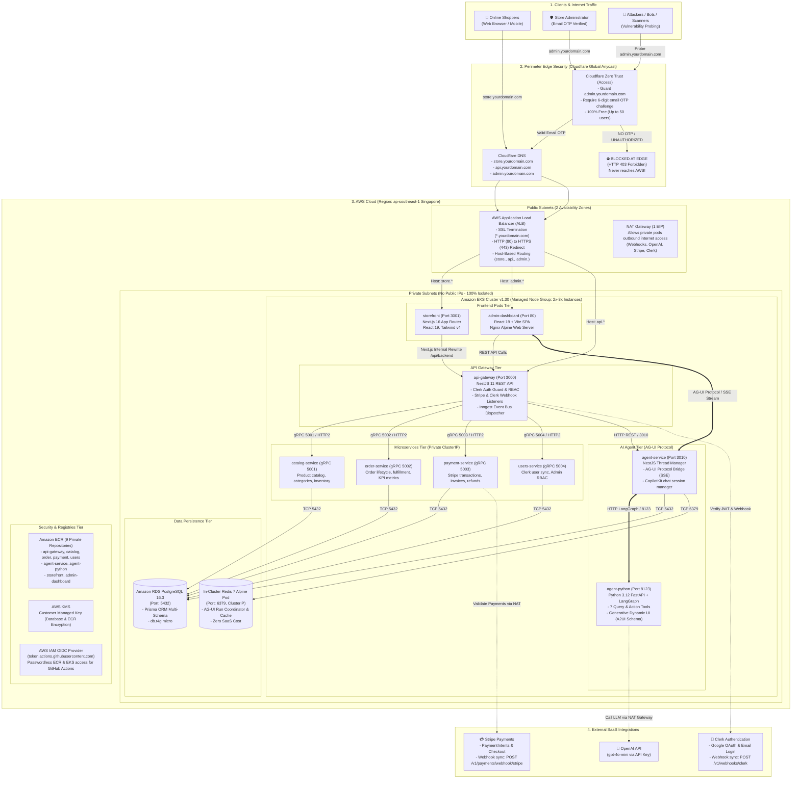
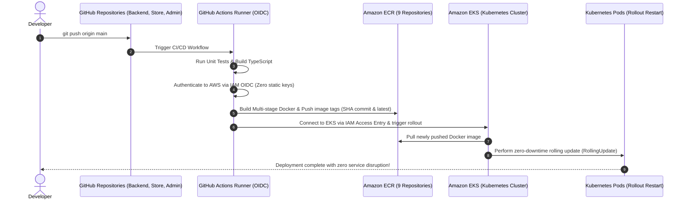

# 🗺️ Full Deployment Architecture & Network Topology

> This document provides an architectural deep dive into the production deployment topology on AWS, perimeter edge security via Cloudflare Zero Trust, internal gRPC/AG-UI inter-service communication, and automated CI/CD delivery pipelines via GitHub Actions.

---

## I. High-Level Infrastructure Diagram

---

## II. Network Protocol Matrix

| Communication Flow | Source | Destination | Protocol / Port | Technical Purpose & Characteristics |
| :--- | :--- | :--- | :--- | :--- |
| **Storefront Web** | User Browser | Cloudflare Edge ➔ ALB | HTTPS / Port 443 | Serves Next.js 16 SSR pages and assets to shoppers |
| **Admin Backoffice** | Admin Browser | Cloudflare Zero Trust | HTTPS / Port 443 | Edge firewall gate requiring 6-digit email OTP verification |
| **API Gateway Ingress**| Web / Webhooks | ALB ➔ Pod `api-gateway` | HTTP / Port 3000 | Public RESTful API routing, Clerk JWT validation, CORS proxy |
| **Catalog gRPC** | Pod `api-gateway` | Pod `catalog-service` | **gRPC (HTTP/2) / 5001** | Sub-millisecond product queries, categories, stock levels |
| **Order gRPC** | Pod `api-gateway` | Pod `order-service` | **gRPC (HTTP/2) / 5002** | Order placement, state transitions, customer history |
| **Payment gRPC** | Pod `api-gateway` | Pod `payment-service` | **gRPC (HTTP/2) / 5003** | Stripe Checkout session creation, webhooks, refund processing |
| **Users gRPC** | Pod `api-gateway` | Pod `users-service` | **gRPC (HTTP/2) / 5004** | Clerk user profile synchronization, Admin RBAC management |
| **AG-UI Event Stream**| Admin Dashboard | Pod `agent-service` | **AG-UI / SSE (Port 3010)** | Real-time chat streaming and generative A2UI dynamic schema |
| **LangGraph Engine** | Pod `agent-service`| Pod `agent-python` | HTTP / Port 8123 | Executes LangGraph state graph with 7 enterprise tool bindings |
| **Database Connection**| Microservices | Amazon RDS | TCP / Port 5432 | Prisma ORM connecting to PostgreSQL 16 multi-schema database |
| **Cache Connection** | Agent Service | In-Cluster Redis Pod | TCP / Port 6379 | Redis 7 Alpine in-memory store for AG-UI session coordinating ($0) |

---

## III. Automated CI/CD Delivery Pipeline

---

## IV. Security Perimeter & Access Boundaries

1. **Edge Perimeter (Cloudflare Global Network)**:
   - All inbound internet traffic must transit through Cloudflare's Anycast edge network.
   - The `admin.yourdomain.com` endpoint is guarded by **Cloudflare Zero Trust Access**: Unauthorized visitors and automated bot scanners are terminated at the nearest Cloudflare edge PoP with `403 Forbidden` before packets ever reach AWS.
2. **Public Network Boundary (AWS Public Subnets)**:
   - Only the **Application Load Balancer (ALB)** and **NAT Gateway** possess public IP addresses.
   - The ALB exposes only port `80` (redirects to 443) and `443` (encrypted HTTPS using ACM wildcard certificates).
3. **Private Network Boundary (AWS Private Subnets)**:
   - All Microservices pods, Amazon RDS PostgreSQL, and In-Cluster Redis reside in private subnets with **no public IPs**.
   - Direct external inbound connection to database instances or internal gRPC ports is architecturally impossible.
4. **Cloud Authentication Boundary (AWS IAM OIDC)**:
   - GitHub Actions connects to AWS using short-lived OpenID Connect (OIDC) Web Identity Tokens.
   - No permanent `AWS_ACCESS_KEY_ID` or `AWS_SECRET_ACCESS_KEY` credentials are saved on GitHub, eliminating credential leak risks.
