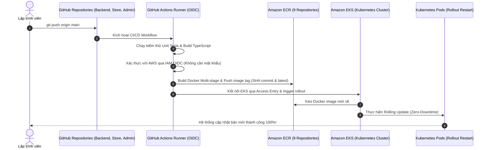

# 🗺️ TỔNG QUAN KIẾN TRÚC TOÀN BỘ HỆ THỐNG KHI DEPLOY (DEPLOYMENT ARCHITECTURE)

> Tài liệu này mô tả chi tiết sơ đồ luồng dữ liệu, phân tầng hạ tầng mạng trên AWS, cơ chế bảo vệ cổng Admin bằng Cloudflare Zero Trust, luồng giao tiếp gRPC/AG-UI giữa các microservices và quy trình tự động hóa CI/CD qua GitHub Actions.

---

## I. SƠ ĐỒ KIẾN TRÚC TỔNG THỂ (HIGH-LEVEL INFRASTRUCTURE DIAGRAM)

---

## II. BẢNG CHI TIẾT GIAO THỨC & CỔNG KẾT NỐI (NETWORK PROTOCOL MATRIX)

| Luồng giao tiếp | Nguồn (Source) | Đích (Destination) | Giao thức / Port | Mục đích & Đặc tính kỹ thuật |
| :--- | :--- | :--- | :--- | :--- |
| **Storefront Web** | Trình duyệt khách | Cloudflare Edge ➔ ALB | HTTPS / Port 443 | Tải mã nguồn SSR Next.js 16, hiển thị giao diện mua sắm |
| **Admin Backoffice** | Trình duyệt Admin | Cloudflare Zero Trust | HTTPS / Port 443 | Chặn cửa ngõ tại Edge, yêu cầu mã OTP email |
| **API Gateway Ingress**| Web / Webhook | ALB ➔ Pod `api-gateway` | HTTP / Port 3000 | Định tuyến các request REST API công khai |
| **Catalog gRPC** | Pod `api-gateway` | Pod `catalog-service` | **gRPC (HTTP/2) / 5001** | Truy vấn kho hàng, danh mục sản phẩm (< 5ms) |
| **Order gRPC** | Pod `api-gateway` | Pod `order-service` | **gRPC (HTTP/2) / 5002** | Tạo đơn hàng, cập nhật trạng thái đơn |
| **Payment gRPC** | Pod `api-gateway` | Pod `payment-service` | **gRPC (HTTP/2) / 5003** | Khởi tạo phiên Stripe Checkout, xử lý hoàn tiền |
| **Users gRPC** | Pod `api-gateway` | Pod `users-service` | **gRPC (HTTP/2) / 5004** | Đồng bộ tài khoản Clerk, gán quyền Admin |
| **AG-UI Event Stream**| Admin Dashboard | Pod `agent-service` | **AG-UI / SSE (Port 3010)** | Stream sự kiện chat và sinh giao diện động A2UI |
| **LangGraph Engine** | Pod `agent-service`| Pod `agent-python` | HTTP / Port 8123 | Thực thi LangGraph graph và 7 tools nghiệp vụ |
| **Database Connection**| Các Microservices | Amazon RDS | TCP / Port 5432 | Prisma ORM giao tiếp với PostgreSQL 16 |
| **Cache Connection** | Agent Service | In-Cluster Redis Pod | TCP / Port 6379 | Bộ nhớ tạm Redis 7 Alpine cho AG-UI Run Coordinator ($0) |

---

## III. QUY TRÌNH TỰ ĐỘNG HÓA CI/CD (DELIVERY PIPELINE)

---

## IV. BẢN ĐỒ BẢO MẬT & PHÂN QUYỀN (SECURITY PERIMETER)

1. **Vành đai ngoài cùng (Edge Perimeter)**:
   - Toàn bộ lưu lượng truy cập phải đi qua mạng lưới Cloudflare.
   - Domain `admin.yourdomain.com` được bảo vệ bằng **Cloudflare Zero Trust Access**: Người ngoài hoặc bot quét cổng bị chặn đứng 100% với mã `403 Forbidden` ngay tại máy chủ biên gần nhất của Cloudflare trước khi gói tin chạm đến AWS.
2. **Vành đai mạng công cộng (AWS Public Subnet)**:
   - Chỉ duy nhất **Application Load Balancer (ALB)** và **NAT Gateway** có Public IP.
   - ALB chỉ mở 2 cổng `80` (tự động redirect sang 443) và `443` (mã hóa SSL HTTPS với chứng chỉ wildcard ACM `*.yourdomain.com`).
3. **Vành đai mạng nội bộ (AWS Private Subnet)**:
   - Toàn bộ các Pod Microservices, Database RDS PostgreSQL và In-Cluster Redis **hoàn toàn KHÔNG có Public IP**.
   - Hacker trên Internet không có bất kỳ cách nào kết nối trực tiếp vào Database hoặc các Pod gRPC.
4. **Vành đai phân quyền Cloud (AWS IAM OIDC)**:
   - GitHub Actions kết nối tới AWS bằng chứng chỉ ngắn hạn (Ephemeral Web Identity Token) thông qua OpenID Connect.
   - Không lưu trữ bất kỳ `AWS_ACCESS_KEY_ID` tĩnh nào trên GitHub, triệt tiêu hoàn toàn nguy cơ lộ khóa API.
